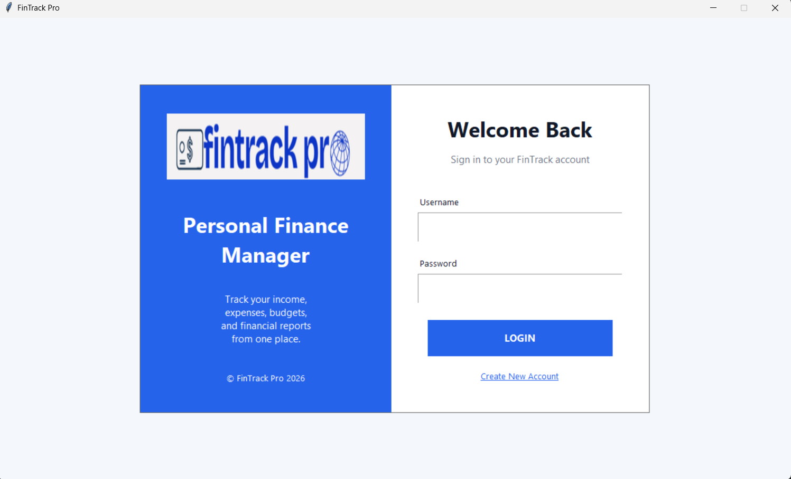
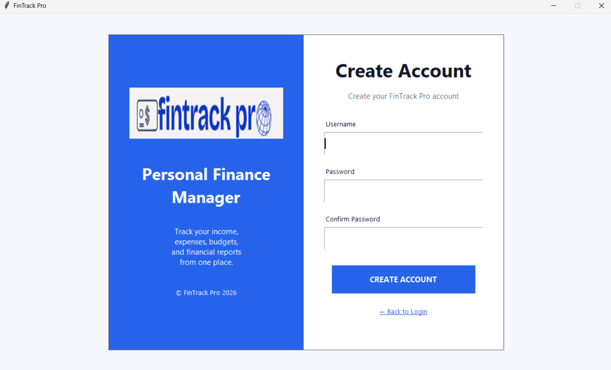
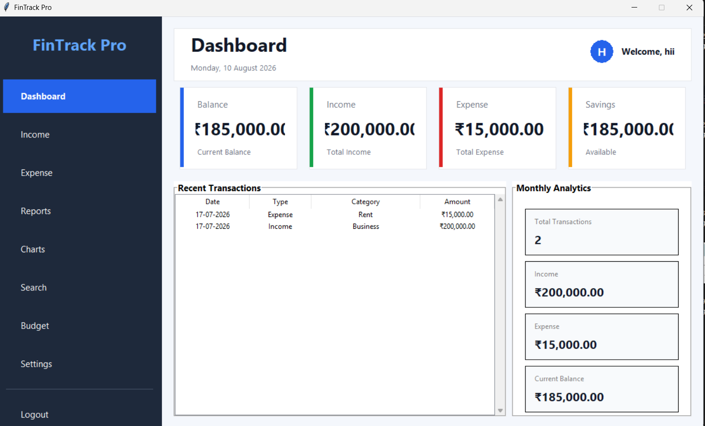
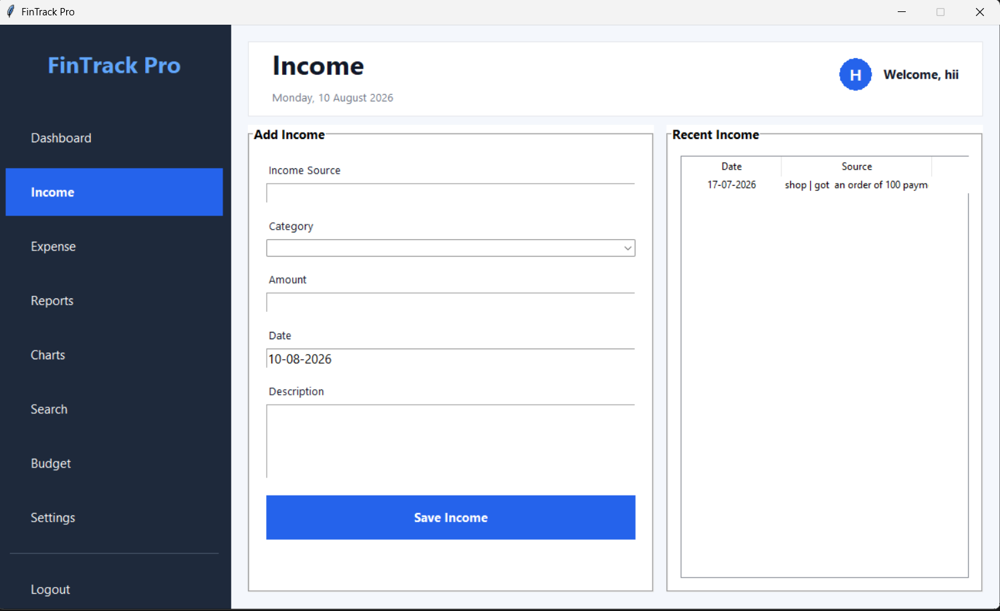
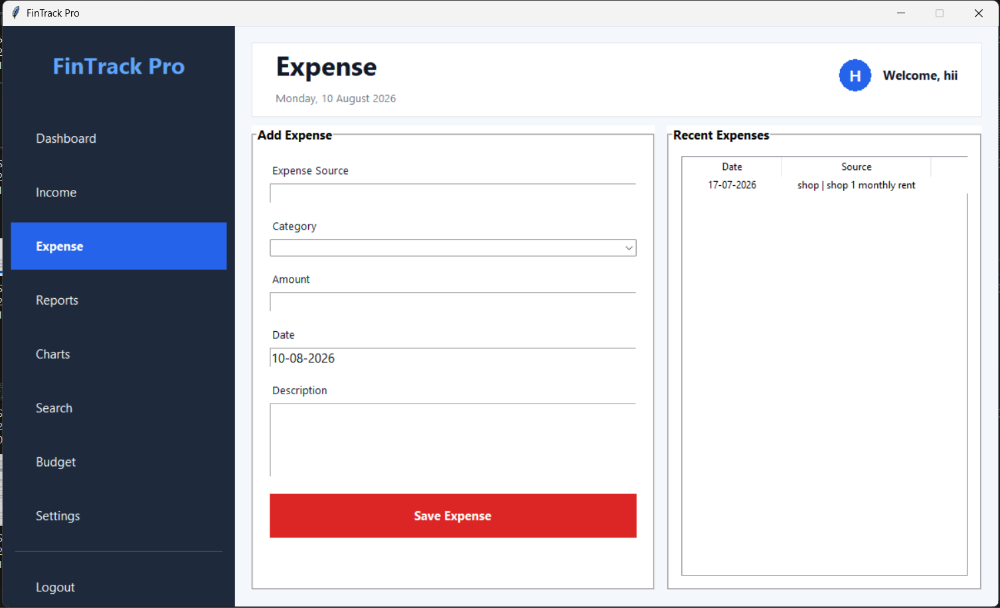
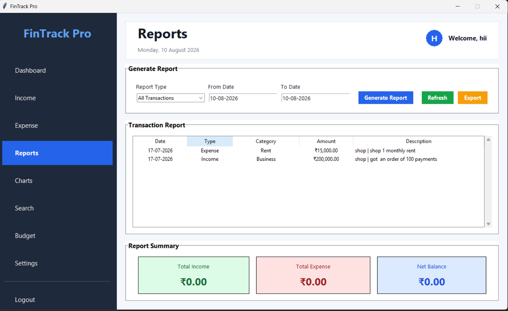
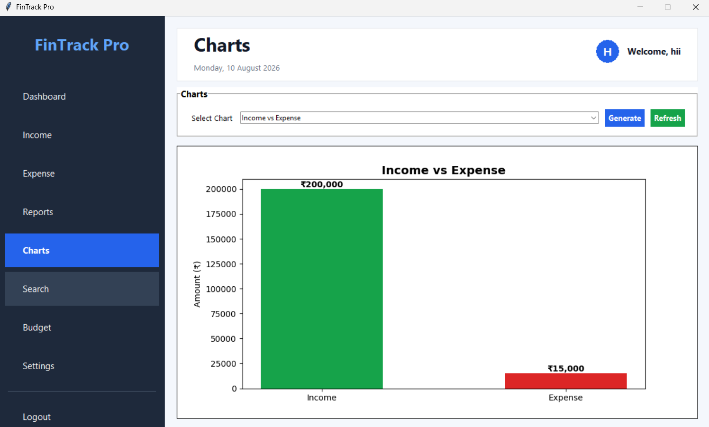
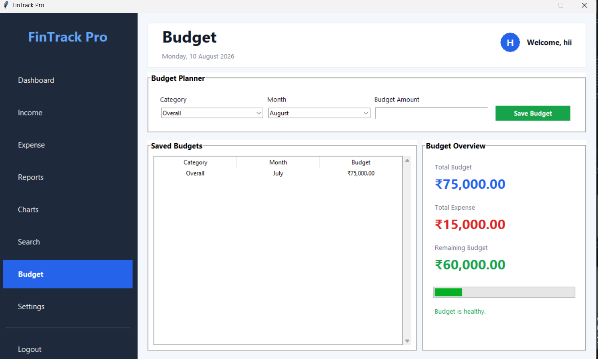

# 💰 FinTrack Pro

<p align="center">
  <b>Personal Finance Manager built with Python and Tkinter</b>
</p>

<p align="center">


</p>

---

## 📌 Overview

**FinTrack Pro** is a desktop-based personal finance management application developed using **Python and Tkinter**.

The application provides a centralized interface for managing personal financial information, including income, expenses, budgets, reports, charts, transaction searches, and account authentication.

The project focuses on building a structured desktop application with a graphical user interface and persistent database storage.

---

## ✨ Features

### 🔐 Authentication
- Create a new user account
- Login using username and password
- Logout functionality

### 📊 Dashboard
- View current balance
- Track total income
- Track total expenses
- View available savings
- Display recent transactions
- View monthly financial summary

### 💰 Income Management
- Add income transactions
- Select income categories
- Enter transaction amount
- Record transaction date
- Add descriptions
- View recent income records

### 💸 Expense Management
- Add expense transactions
- Select expense categories
- Enter expense amount
- Record transaction date
- Add descriptions
- View recent expenses

### 📑 Reports
- Generate transaction reports
- Filter transactions by date
- Filter report type
- View income and expense summaries
- Calculate net balance
- Export reports

### 📈 Charts & Analytics
- Visualize income and expenses
- Generate financial charts
- Compare income against expenses

### 🔎 Transaction Search
- Search financial transactions
- Search by keyword
- Filter search results
- View matching transaction records

### 🎯 Budget Management
- Create monthly budgets
- Select budget categories
- Set budget amounts
- Track total budget
- Monitor expenses against budget
- View remaining budget

### ⚙️ Settings
- Application settings
- User-related configuration

---

## 🛠️ Tech Stack

| Technology | Purpose |
|------------|---------|
| 🐍 Python | Core application development |
| 🖥️ Tkinter | Desktop graphical user interface |
| 🗄️ SQLite | Local database storage |
| 📊 Matplotlib | Data visualization |
| 🧩 Object-Oriented Python | Application structure and components |

---

## 🏗️ Project Structure

```text
FinTrack-Pro/
│
├── assets/
│
├── database/
│   ├── __init__.py
│   └── database.py
│
├── screenshots/
│   ├── Login.png
│   ├── Create_Account.png
│   ├── Dashboard.png
│   ├── Income.png
│   ├── Expense.png
│   ├── Reports.png
│   ├── Charts.png
│   ├── Budget.png
│   └── Logout.png
│
├── src/
│   ├── components/
│   ├── models/
│   ├── pages/
│   │   ├── budget.py
│   │   ├── charts.py
│   │   ├── dashboard_page.py
│   │   ├── expense.py
│   │   ├── income.py
│   │   ├── profile.py
│   │   ├── reports.py
│   │   ├── search.py
│   │   └── settings.py
│   │
│   ├── utils/
│   ├── auth.py
│   ├── dashboard.py
│   └── navigation.py
│
├── main.py
├── requirements.txt
├── LICENSE
└── README.md
````

---

## 🚀 Getting Started

### 1️⃣ Clone the Repository

```bash
git clone https://github.com/bhumiijainn/FinTrack-Pro.git
```

Move into the project directory:

```bash
cd FinTrack-Pro
```

---

### 2️⃣ Create a Virtual Environment

#### Windows

```bash
python -m venv venv
```

Activate it:

```bash
venv\Scripts\activate
```

#### macOS / Linux

```bash
python3 -m venv venv
```

Activate it:

```bash
source venv/bin/activate
```

---

### 3️⃣ Install Dependencies

```bash
pip install -r requirements.txt
```

> **Note:** The current repository's `requirements.txt` is empty, so the application primarily relies on Python's standard-library components. ([GitHub][2])

---

### 4️⃣ Run the Application

From the project root directory:

```bash
python main.py
```

The application will open as a desktop window.

The repository's `main.py` creates the Tkinter root window, initializes the database manager, loads the authentication screen and starts the Tkinter event loop. ([GitHub][3])

---

## 🖥️ Application Screenshots

### 🔐 Login



---

### 📝 Create Account



---

### 📊 Dashboard



---

### 💰 Income Management



---

### 💸 Expense Management



---

### 📑 Reports



---

### 📈 Charts & Analytics



---

### 🎯 Budget Planner



---

### 🚪 Logout


---

## 🔄 Application Workflow

```text
             ┌─────────────────┐
             │   Start FinTrack │
             │       Pro        │
             └────────┬────────┘
                      │
                      ▼
             ┌─────────────────┐
             │ Authentication  │
             │ Login / Signup  │
             └────────┬────────┘
                      │
                      ▼
             ┌─────────────────┐
             │    Dashboard    │
             └────────┬────────┘
                      │
        ┌─────────────┼─────────────┐
        ▼             ▼             ▼
     Income        Expense        Budget
        │             │             │
        └─────────────┼─────────────┘
                      ▼
             ┌─────────────────┐
             │    Database     │
             │    Storage      │
             └────────┬────────┘
                      │
          ┌───────────┼───────────┐
          ▼           ▼           ▼
       Reports      Charts      Search
```

---

## 📚 Key Modules

### `main.py`

Application entry point responsible for creating the main Tkinter window, initializing the database manager and loading authentication. ([GitHub][3])

### `database/`

Contains the database management layer used for persistent application data. ([GitHub][4])

### `src/auth.py`

Handles the application's authentication interface.

### `src/dashboard.py`

Provides the dashboard-level application functionality.

### `src/pages/`

Contains the individual application pages for:

* Dashboard
* Income
* Expense
* Reports
* Charts
* Search
* Budget
* Profile
* Settings

These modules are present in the current repository structure. ([GitHub][5])

---

## 🎯 Learning Objectives

This project demonstrates practical implementation of:

* Python application development
* Tkinter GUI development
* Object-oriented programming
* Desktop application architecture
* Database integration
* CRUD-style transaction management
* Data visualization
* Financial data organization
* User authentication
* Modular project structure

---

## 🔮 Future Improvements

Potential future improvements include:

* 📱 Mobile version
* ☁️ Cloud database synchronization
* 📤 Improved CSV/Excel import and export
* 🔔 Budget notifications
* 🔐 Stronger authentication and password security
* 📊 More advanced financial analytics
* 🧾 PDF report generation
* 💾 Automated database backup

---

## 📄 License

This project is licensed under the **MIT License**.

---

## 👩‍💻 Author

**Bhumi Jain**

GitHub: [@bhumiijainn](https://github.com/bhumiijainn)

---

⭐ If you found this project useful, consider giving it a star!


I'd also keep the **`MIT License` badge and the Python/Tkinter/SQLite badges**. Don't add fake badges such as "Build Passing", "CI", "Docker", "AI", or "100% Python" when you don't actually have those things. The repository currently shows an MIT license and a Python/Tkinter-based structure, so these badges accurately represent the project. ([GitHub][1]) 

[1]: https://github.com/bhumiijainn/FinTrack-Pro "GitHub - bhumiijainn/FinTrack-Pro · GitHub"
[2]: https://github.com/bhumiijainn/FinTrack-Pro/blob/main/requirements.txt "FinTrack-Pro/requirements.txt at main · bhumiijainn/FinTrack-Pro · GitHub"
[3]: https://github.com/bhumiijainn/FinTrack-Pro/blob/main/main.py "FinTrack-Pro/main.py at main · bhumiijainn/FinTrack-Pro · GitHub"
[4]: https://github.com/bhumiijainn/FinTrack-Pro/tree/main/database "FinTrack-Pro/database at main · bhumiijainn/FinTrack-Pro · GitHub"
[5]: https://github.com/bhumiijainn/FinTrack-Pro/tree/main/src/pages "FinTrack-Pro/src/pages at main · bhumiijainn/FinTrack-Pro · GitHub"
