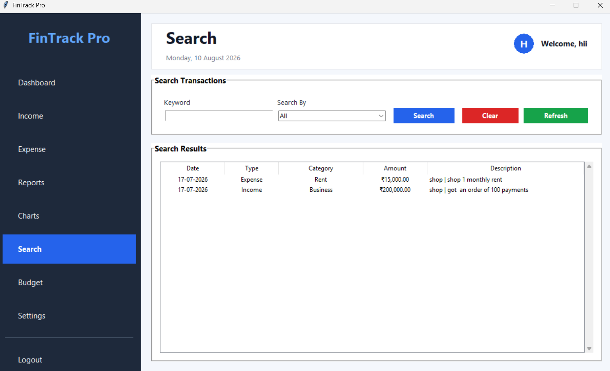

<h1 align="center">💰 FinTrack Pro</h1>

<p align="center">
  <strong>Personal Finance Management • Desktop Application • Financial Tracking</strong>
</p>

<p align="center">
  
  
  
  
  
  
</p>

---

## 📌 Overview

**FinTrack Pro** is a Python-based personal finance management desktop application built using **Tkinter** with a local **SQLite database**.

The application provides a centralized interface for managing personal financial information, including income, expenses, budgets, reports, charts, and transaction searches.

The project follows a modular structure with separate authentication, dashboard, database, reusable UI components, and application pages.

---

## 🎯 Objectives

- 💰 Manage personal income and expenses
- 📊 Provide a financial overview through a dashboard
- 🎯 Manage monthly budgets
- 📈 Visualize financial information through charts
- 🔎 Search stored transactions
- 📑 Generate financial reports
- 👤 Support user accounts and profiles
- ⚙️ Store user-specific settings
- 💾 Maintain financial data using SQLite

---

## ✨ Key Features

### 🔐 Authentication

- User registration
- User login
- User-specific data handling
- Profile management

### 📊 Dashboard

- Financial overview
- Summary statistics
- Transaction information
- Navigation to major application modules

### 💵 Income Management

- Add income records
- Categorize income
- Store transaction dates
- Maintain transaction descriptions

### 💸 Expense Management

- Add expense records
- Categorize expenses
- Track amounts
- Store transaction dates and descriptions

### 🎯 Budget Management

- Create budgets by category
- Set monthly budget values
- Track budget information

### 📈 Charts

- Visualize financial information
- Analyze income and expenses
- Present financial data graphically

### 📑 Reports

- View financial transaction information
- Generate summaries from stored financial data

### 🔎 Search

- Search financial transactions
- Filter stored transaction information

### ⚙️ Settings

- Currency preference
- Theme preference
- Notification settings

---

## 🛠️ Tech Stack

| Technology | Purpose |
|---|---|
| 🐍 Python | Core application logic |
| 🖥️ Tkinter | Desktop graphical user interface |
| 🗄️ SQLite | Local database storage |
| 📊 Matplotlib | Financial charts and visualization |
| 📦 Python Standard Library | Application utilities |

---

## 🏗️ Application Architecture

```text
                    FinTrack Pro
                         │
                         ▼
                  ┌─────────────┐
                  │   main.py   │
                  └──────┬──────┘
                         │
                         ▼
                  ┌─────────────┐
                  │ Authentication│
                  │    Screen     │
                  └──────┬────────┘
                         │
                         ▼
                  ┌─────────────┐
                  │  Dashboard  │
                  └──────┬──────┘
                         │
       ┌─────────────────┼─────────────────┐
       ▼                 ▼                 ▼
    Income            Expense           Budget
       │                 │                 │
       └─────────────────┼─────────────────┘
                         ▼
                  ┌─────────────┐
                  │   Reports   │
                  └──────┬──────┘
                         │
                         ▼
                  ┌─────────────┐
                  │   Charts    │
                  └──────┬──────┘
                         │
                         ▼
                  ┌─────────────┐
                  │   Search    │
                  └─────────────┘
                         │
                         ▼
                  ┌─────────────┐
                  │   SQLite    │
                  │   Database  │
                  └─────────────┘
```

---

## 💾 Database

FinTrack Pro uses **SQLite** for local data storage.

The application initializes the database automatically through the `DatabaseManager` class.

### 📊 Database Overview

| Property | Details |
|---|---|
| 🗄️ Database | SQLite |
| 📁 Database Location | `database/finance.db` |
| 👤 User Data | `users` table |
| 💰 Financial Transactions | `transactions` table |
| 🎯 Budgets | `budgets` table |
| ⚙️ User Settings | `settings` table |

### 📋 Database Tables

#### 👤 Users

Stores account information such as:

- Username
- Password
- Full name
- Email
- Phone
- Account creation time

#### 💳 Transactions

Stores financial transaction information including:

- Transaction ID
- User ID
- Transaction type
- Category
- Amount
- Description
- Date
- Creation timestamp

#### 🎯 Budgets

Stores budget information including:

- Budget ID
- User ID
- Category
- Budget amount
- Month
- Creation timestamp

#### ⚙️ Settings

Stores user-specific preferences such as:

- Currency
- Theme
- Notifications

> 📌 The application creates these four tables when the database is initialized.

---

## 🔄 Application Workflow

```text
Launch Application
        │
        ▼
Authentication
        │
        ├── New User ──► Create Account
        │
        └── Existing User ──► Login
                              │
                              ▼
                         Dashboard
                              │
             ┌────────────────┼────────────────┐
             ▼                ▼                ▼
           Income          Expense           Budget
             │                │                │
             └────────────────┼────────────────┘
                              ▼
                          Reports
                              │
                              ▼
                           Charts
                              │
                              ▼
                           Search
                              │
                              ▼
                           Logout
```

---

## 📸 Application Screenshots

### 🔐 Login


---

### 👤 Create Account


---

### 📊 Dashboard


---

### 💵 Income


---

### 💸 Expense


---

### 📑 Reports


---

### 📈 Charts


---

### 🔎 Search / Transactions



---

### 🎯 Budget


---

### 🚪 Logout


---

## 📁 Repository Structure

```text
FinTrack-Pro/
│
├── 📂 assets/
│
├── 📂 database/
│   ├── __init__.py
│   └── database.py
│
├── 📂 screenshots/
│   ├── 🖼️ Budget.png
│   ├── 🖼️ Charts.png
│   ├── 🖼️ Create Account.png
│   ├── 🖼️ Dashboard.png
│   ├── 🖼️ Expense.png
│   ├── 🖼️ Income.png
│   ├── 🖼️ Login.png
│   ├── 🖼️ Logout.png
│   └── 🖼️ Reports.png
│
├── 📂 src/
│   ├── 📂 components/
│   │   ├── card.py
│   │   ├── dialog.py
│   │   ├── header.py
│   │   ├── sidebar.py
│   │   ├── stats_card.py
│   │   └── table.py
│   │
│   ├── 📂 models/
│   │
│   ├── 📂 pages/
│   │   ├── budget.py
│   │   ├── charts.py
│   │   ├── dashboard_page.py
│   │   ├── expense.py
│   │   ├── income.py
│   │   ├── profile.py
│   │   ├── reports.py
│   │   ├── search.py
│   │   └── settings.py
│   │
│   ├── 📂 utils/
│   │
│   ├── __init__.py
│   ├── auth.py
│   ├── dashboard.py
│   └── navigation.py
│
├── 📄 main.py
├── 📄 requirements.txt
├── 📄 LICENSE
└── 📄 README.md
```

---

## ▶️ Getting Started

### 1. Clone the Repository

```bash
git clone https://github.com/bhumiijainn/FinTrack-Pro.git
```

### 2. Navigate to the Project

```bash
cd FinTrack-Pro
```

### 3. Check Python

```bash
python --version
```

Python 3.x is recommended.

### 4. Install Dependencies

The current `requirements.txt` file is empty, so there are currently no third-party packages listed for installation.

```bash
pip install -r requirements.txt
```

> 📌 FinTrack Pro currently relies on Python's built-in Tkinter and SQLite functionality. The repository's `requirements.txt` currently contains no package entries.

### 5. Run the Application

```bash
python main.py
```

The application will open as a desktop window.

---

## 🖥️ Application Window

The application creates a **1200 × 700** Tkinter window and loads the authentication screen when started. The main entry point is `main.py`. :contentReference[oaicite:2]{index=2}

---

## 🔐 Data Storage

FinTrack Pro stores data locally using SQLite.

The database manager:

```text
database/database.py
        │
        ▼
   finance.db
        │
        ├── users
        ├── transactions
        ├── budgets
        └── settings
```

The database uses foreign-key relationships between users and their transactions, budgets, and settings. :contentReference[oaicite:3]{index=3}

---

## 🧩 Modular Design

The application separates functionality into reusable modules.

### Components

```text
src/components/
│
├── card.py
├── dialog.py
├── header.py
├── sidebar.py
├── stats_card.py
└── table.py
```

These components provide reusable interface elements such as cards, dialogs, headers, sidebars, statistics cards, and tables. :contentReference[oaicite:4]{index=4}

### Pages

```text
src/pages/
│
├── budget.py
├── charts.py
├── dashboard_page.py
├── expense.py
├── income.py
├── profile.py
├── reports.py
├── search.py
└── settings.py
```

The page modules separate the major financial-management features of the application. :contentReference[oaicite:5]{index=5}

---

## 📌 Project Highlights

- 🖥️ Desktop-based finance management application
- 🐍 Built entirely with Python
- 🎨 Tkinter graphical user interface
- 🗄️ SQLite local database
- 👤 User authentication
- 💵 Income management
- 💸 Expense management
- 🎯 Budget management
- 📊 Financial charts
- 📑 Reports
- 🔎 Transaction search
- ⚙️ User settings
- 🧩 Modular application structure

---

## 🔮 Future Improvements

- 📤 Export financial reports to CSV and PDF
- 📅 Add recurring transactions
- 🔔 Add scheduled financial reminders
- 📊 Add more advanced financial analytics
- 💳 Add more transaction categories
- 🔐 Improve password security and credential handling
- 💾 Add database backup and restore
- 📦 Package the application as a standalone executable
- 🌐 Add optional cloud synchronization
- 📱 Explore a cross-platform version

---

## 👩‍💻 Author

### Bhumi Jain

<p>
  <a href="https://github.com/bhumiijainn">
    
  </a>
  <a href="https://www.linkedin.com/in/bhumi-jainn/">
    
  </a>
</p>

---

⭐ **If you find FinTrack Pro useful, consider starring the repository.**
